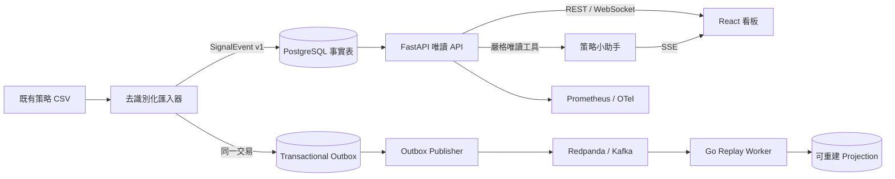

# SignalOps AI 架構

SignalOps AI 是這個 repository 內可獨立展示的策略維運產品。它把既有策略的持倉變化轉成可稽核、去識別化的事件，並提供即時看板與唯讀 AI 助手。原有交易程式仍負責執行；SignalOps 不持有券商憑證，也沒有下單介面。

產品定位受到《富爸爸，窮爸爸》ESBI 現金流象限啟發：先把依賴本人的 S 象限執行流程，轉成由事件、監控與交接機制運作的 B 象限系統；再用可靠成交、成本與資金曲線判斷是否能成為 I 象限的可配置資產。這裡的 B 是 Business Owner、I 是 Investor，不是 Business Intelligence。

## Repository 邊界

```text
monitor/
├── backend-futures-py/          # 既有訊號收集與交易執行
└── signalops/                   # 可獨立啟動與部署的 side project
    ├── backend-signalops-py/    # FastAPI、資料匯入、outbox publisher
    ├── frontend-react/          # React／TypeScript 網頁
    ├── workers/signal-replay-go/# Kafka replay 與 projection worker
    ├── contracts/               # 跨語言、具版本的事件契約
    ├── observability/           # OTel、Prometheus、Grafana
    ├── infra/                   # Helm 與 Terraform 部署骨架
    └── docs/                    # 架構決策、操作手冊與事件演練
```

刻意不把既有服務全面搬到 `apps/`。大規模改名不會增加作品價值，反而提高現有交易程式的回歸風險。

## 執行時資料流



瀏覽器不會下載來源 CSV。匯入器會移除原始訊息，以加鹽雜湊取代帳號，驗證持倉轉換並用事件 ID 去重。API 的數字來自 PostgreSQL；AI 助手只能呼叫同一批唯讀 domain tools。

## 技術線與職涯對應

| 能力面向 | 實作技術 | 作品要證明的能力 |
| --- | --- | --- |
| 前端／全端 | React 19、TypeScript、Vite、Vitest | 適合 Binance、外商與遠端產品團隊 |
| Python 後端 | Python 3.12+、FastAPI、Pydantic | API、資料工程與 LLM 整合 |
| 資料層 | PostgreSQL、SQLAlchemy、Alembic | 交易一致性、索引、migration 與查詢投影 |
| 即時互動 | WebSocket、SSE | 即時事件與串流回答的連線生命週期 |
| LLM | OpenAI Responses API、strict tool calling | 可驗證的工具式回答，不靠模型臆測數字 |
| 分散式系統 | Transactional outbox、Redpanda/Kafka | 事件發布、至少一次傳遞與失敗重試 |
| 第二後端語言 | Go、franz-go、pgx | consumer group、冪等處理與高併發服務思維 |
| 可觀測性 | Prometheus、Grafana、OpenTelemetry | 指標、trace 與 incident 診斷 |
| 交付 | Docker Compose、GitHub Actions、Helm、Terraform | 可重現建置、CI 與雲端基礎設施表達 |

## 一致性與失敗模型

- 匯入 `signal_events` 與寫入 `outbox_events` 在同一個 PostgreSQL transaction；不會只有其中一邊成功。
- publisher 只有在 broker 確認後才標記 `published_at`，失敗會保留事件供下次重試。
- Go worker 採至少一次傳遞，以 `processed_events.event_id` 去重；projection 成功 commit 後才提交 Kafka offset。
- `strategy_projections` 是可丟棄的 read model；`signal_events` 才是不可變事實來源。
- WebSocket 目前從事實表輪詢增量事件，避免把 broker 變成 MVP 查詢的單點依賴。

## 安全不變量

- `.env`、憑證、Telegram session 與券商金鑰不會進入 SignalOps image 或資料庫。
- 原始帳號不落地，只儲存加鹽且截短的 SHA-256 reference。
- 匯入時丟棄 `signal` 等自由文字，降低提示注入與個資外洩風險。
- AI 助手沒有寫入與交易工具，也不回傳 `account_ref` 或任意 `attributes`。
- 公開 demo 只能使用去識別化資料庫匯出的內容，不直接掛載 `tv_doc`。

## 已知資料限制

`six_strategy_signal_events.csv` 有持倉轉換，卻沒有每筆可靠的進場價或成交價。因此目前只展示訊號、事件統計與當前持倉，不虛構 PnL。若未來 producer 能提供 `reference_price` 或獨立 fill event，再加入績效與滑價分析。
